<!DOCTYPE html>
<html lang="en">
<head>
  <meta charset="UTF-8">
  <title>Masters-App</title>
</head>
<body>

  <h1>Masters-App</h1>
  

    Masters-App is designed to connect GitHub’s API and agile development principles in one cohesive platform.
    Whether you’re a solo developer or part of a scrum team, Masters-App streamlines your workflow by offering planning tools,
    Kanban boards, burndown charts, Gantt charts, and more.
  

  

  <h2>Screenshots</h2>

  <figure>
    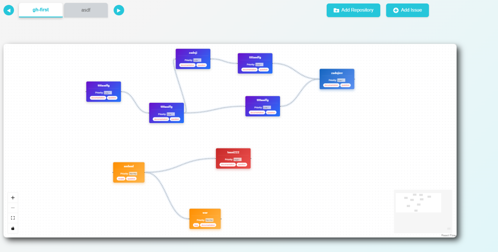
    <figcaption style="font-weight: bold; font-size: 14px; color: #444; margin-top: 4px; text-align: center;">
      Overview of the app – see your project at a glance.
    </figcaption>
  </figure>

  <figure>
    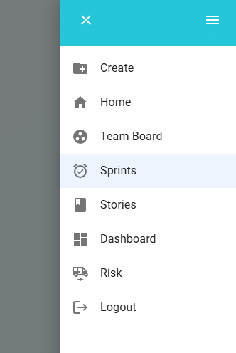
    <figcaption style="font-weight: bold; font-size: 14px; color: #444; margin-top: 4px; text-align: center;">
      Sidebar – intuitive navigation to move between features.
    </figcaption>
  </figure>

  <figure>
    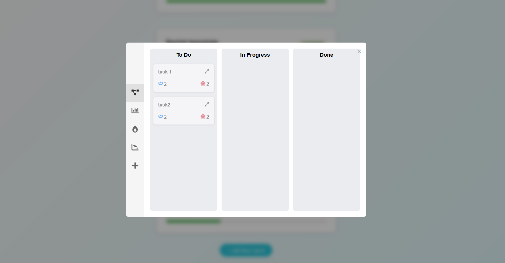
    <figcaption style="font-weight: bold; font-size: 14px; color: #444; margin-top: 4px; text-align: center;">
      Kanban board – manage tasks and track progress in real time.
    </figcaption>
  </figure>

  <figure>
    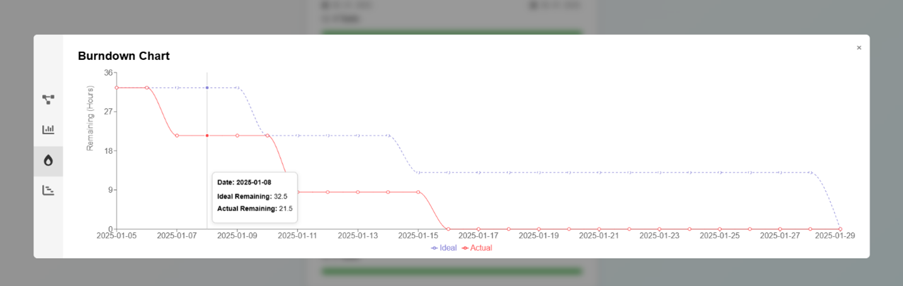
    <figcaption style="font-weight: bold; font-size: 14px; color: #444; margin-top: 4px; text-align: center;">
      Burndown chart – visualize sprint velocity and completion rates.
    </figcaption>
  </figure>

  <figure>
    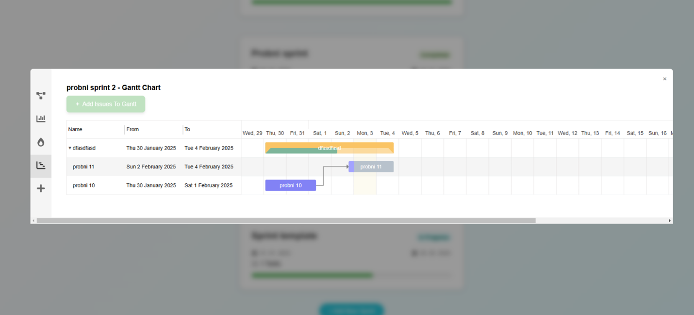
    <figcaption style="font-weight: bold; font-size: 14px; color: #444; margin-top: 4px; text-align: center;">
      Gantt chart – plan and organize tasks on a timeline.
    </figcaption>
  </figure>

  <figure>
    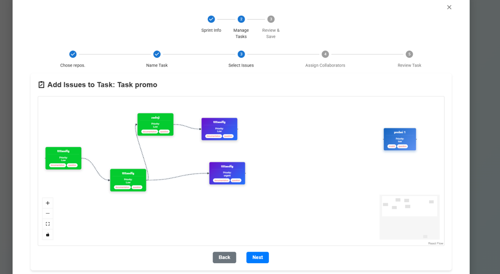
    <figcaption style="font-weight: bold; font-size: 14px; color: #444; margin-top: 4px; text-align: center;">
      Task creation – quickly add new items to your backlog.
    </figcaption>
  </figure>

  <figure>
    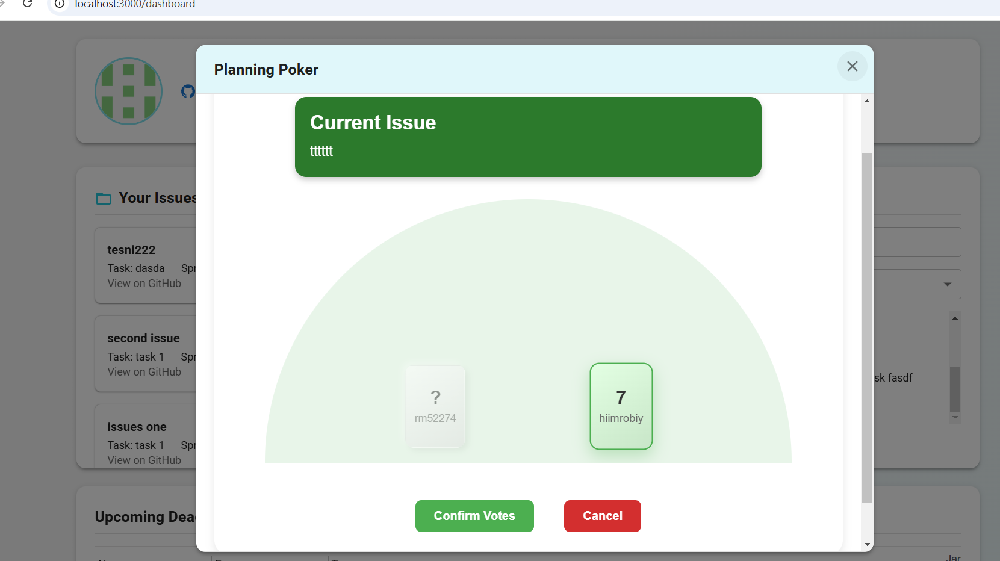
    <figcaption style="font-weight: bold; font-size: 14px; color: #444; margin-top: 4px; text-align: center;">
      Planning – set up sprints, assign tasks, and define deadlines.
    </figcaption>
  </figure>

  <figure>
    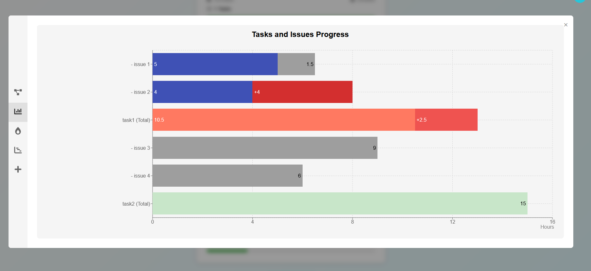
    <figcaption style="font-weight: bold; font-size: 14px; color: #444; margin-top: 4px; text-align: center;">
      Projections – forecast future workloads and timelines.
    </figcaption>
  </figure>

  <figure>
    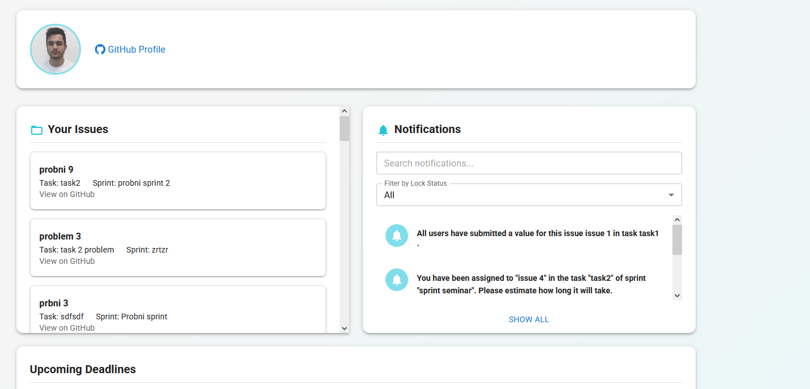
    <figcaption style="font-weight: bold; font-size: 14px; color: #444; margin-top: 4px; text-align: center;">
      Dashboard – track key metrics and project health at a glance.
    </figcaption>
  </figure>

  <figure>
    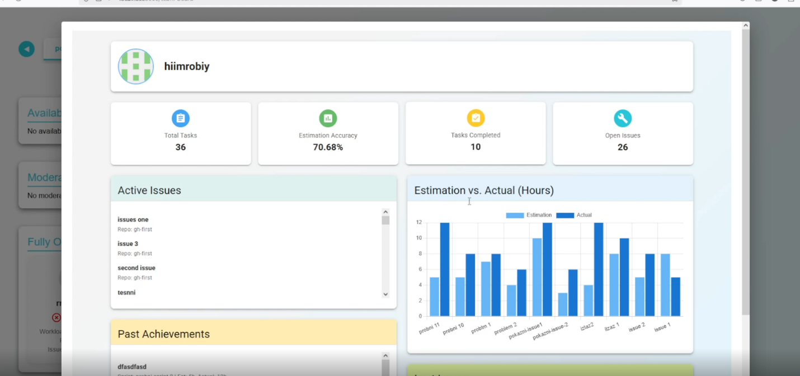
    <figcaption style="font-weight: bold; font-size: 14px; color: #444; margin-top: 4px; text-align: center;">
      Statistics – analyze performance data and progress trends.
    </figcaption>
  </figure>

  <figure>
    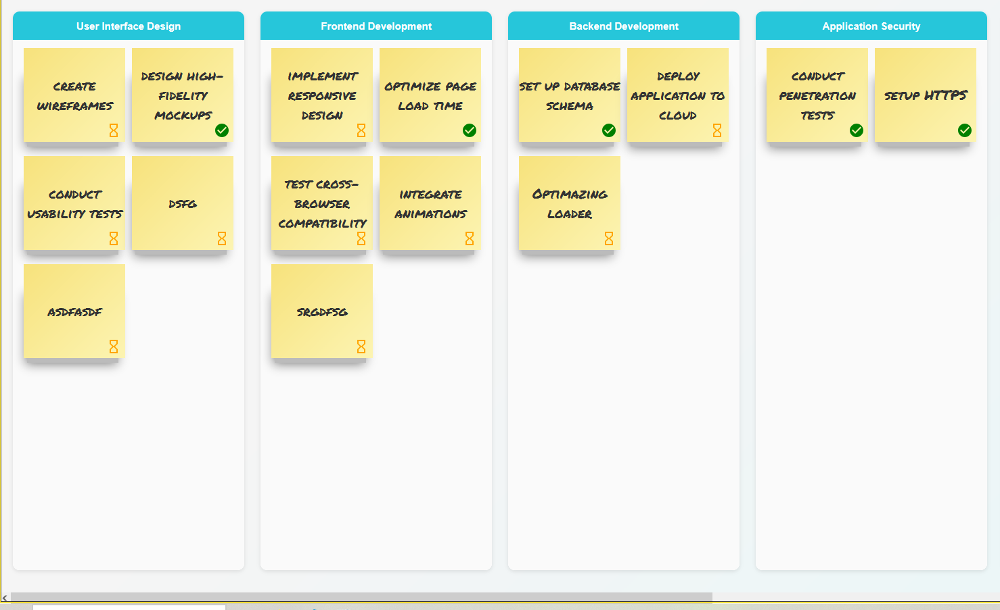
    <figcaption style="font-weight: bold; font-size: 14px; color: #444; margin-top: 4px; text-align: center;">
      Epics – manage large-scale features and break them down into actionable tasks.
    </figcaption>
  </figure>

  

  <h2>Usage & Contributions</h2>
  

    To get started with Masters-App, clone the repository and follow the setup instructions in the project’s documentation.
    Contributions are always welcome—feel free to open issues or submit pull requests for improvements, bug fixes, or new features.
  

</body>
</html>
